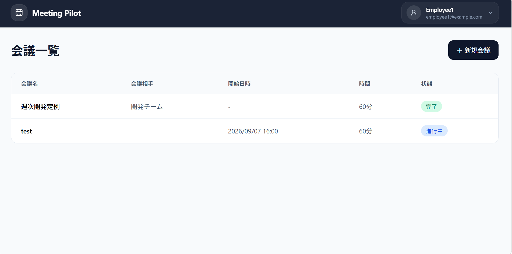
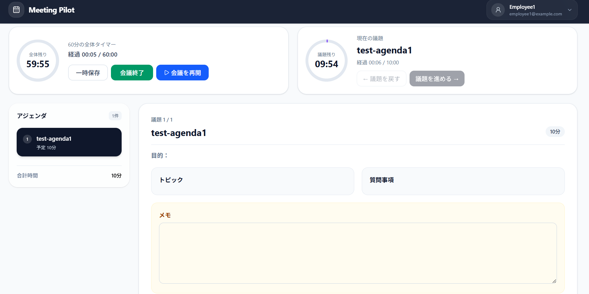

# MeetingPilot

会議の準備から進行、記録までを一元管理する会議管理アプリケーションです。

アジェンダごとの時間管理、会議中のリアルタイム同期、参加メンバーと編集担当者の権限制御により、会議を円滑に進行できることを目指して開発しています。

## デモ・スクリーンショット

> 公開URLや画像は、デプロイ後に追加予定です。

<!--
例:


-->

## 主な機能

### 認証

- ユーザー登録
- ログイン・ログアウト
- bcryptによるパスワードのハッシュ化
- HttpOnly CookieとJWTを利用した認証
- 認証ユーザー取得
- 未ログインユーザーの画面・APIアクセス制御

### 会議管理

- 会議の作成・一覧表示・詳細表示・編集・削除
- 会議名、説明、対象者、開始予定日時、予定時間の管理
- 会議ステータス管理
  - `scheduled`
  - `in_progress`
  - `completed`
- 自分が主催または参加している会議のみ一覧表示

### アジェンダ管理

- アジェンダの追加・編集・削除
- アジェンダの並び替え
- 概要、トピック、質問事項、予定時間、メモの管理
- 会議予定時間とアジェンダ合計時間の比較表示

### 会議セッション

- 会議開始・終了
- 会議全体タイマー
- アジェンダごとのタイマー
- 予定時間超過後の超過時間表示
- 会議の一時停止・再開
- 議題を進める・戻す操作
- リロード後のタイマー・進行状態の復元
- メモ、決定事項、TODOの入力と一時保存

### リアルタイム同期

WebSocketを利用して、同じ会議を開いている複数ブラウザ間で以下を同期します。

- 会議開始
- 会議終了
- 現在の議題
- 一時停止・再開
- セッション内容の一時保存
- セッション編集者の変更

タイマー値を毎秒配信するのではなく、開始時刻や経過時間をDBで管理し、各クライアントが表示値を計算する設計にしています。

### 会議メンバー・権限管理

- メールアドレスによるメンバー候補検索
- 会議メンバーの追加・削除
- 自分自身を削除した場合は会議から脱退
- 会議ごとに編集者を最大1人設定
- Session中に主催者が編集者を設定・変更・解除

#### ロール

- `owner`
  - `meetings.created_by` で管理
  - `meeting_members` には登録しない
  - 会議削除、セッション編集者の変更が可能
- `editor`
  - セッション中のメモ、決定事項、TODOを編集・一時保存可能
  - 会議ごとに最大1人
- `viewer`
  - 通常の参加者
  - 会議情報やセッション内容を閲覧可能

編集者が未設定の場合は主催者がセッション編集を担当し、編集者が設定されている場合は、その編集者のみが入力・一時保存できます。

## 技術スタック

### Frontend

- React
- TypeScript
- Vite
- React Router
- Tailwind CSS
- Lucide React
- WebSocket API

### Backend

- Go
- Echo
- PostgreSQL
- gorilla/websocket
- golang-jwt/jwt
- bcrypt

### Infrastructure / Development

- Docker
- Docker Compose
- SQL Migration
- Go testing
- go-sqlmock
- Vitest
- React Testing Library

## アーキテクチャ

```text
frontend/
├─ src/
│  ├─ components/
│  ├─ contexts/
│  ├─ hooks/
│  ├─ layouts/
│  ├─ pages/
│  └─ types/

backend/
├─ cmd/
│  └─ api/
└─ internal/
   ├─ auth/
   ├─ handler/
   ├─ middleware/
   ├─ model/
   ├─ repository/
   ├─ validator/
   └─ websocket/
```

バックエンドは、主に以下の責務へ分割しています。

- `handler`: HTTPリクエスト・レスポンス、認証・認可の制御
- `repository`: SQL実行とトランザクション管理
- `model`: DBモデル・リクエスト・レスポンス構造体
- `middleware`: JWT認証
- `auth`: JWTの生成・検証
- `validation`: 入力値検証
- `websocket`: 接続管理とイベント配信

## 認証・認可設計

### 認証

1. ログイン時にメールアドレスとパスワードを検証
2. JWTを生成
3. JWTをHttpOnly Cookieへ保存
4. 認証MiddlewareがCookieからJWTを検証
5. JWT内のユーザーIDをEcho Contextへ格納

フロント側の`ProtectedRoute`だけに依存せず、認証が必要なAPIにもMiddlewareを適用しています。

### 認可

会議関連APIでは、ログインしているかだけでなく、そのユーザーが対象会議の主催者または参加メンバーであるかをバックエンドで確認します。

```text
認証: ログイン済みか
認可: 対象会議を閲覧・操作できるか
```

セッション内容の保存では、さらに以下を確認します。

```text
editor設定あり → editor本人のみ保存可能
editor設定なし → ownerのみ保存可能
viewer          → 保存不可
```

## タイマー設計

会議全体と各アジェンダの時間は、単純なフロントエンドのカウント値だけではなく、DBに保存した時刻と累積時間を基準に計算しています。

### 会議全体

```text
実際の経過時間
= 現在時刻 - actual_start_at - total_paused_seconds
```

一時停止中は`paused_at`を計算の終点として使用し、表示時間を固定します。

### アジェンダ

各アジェンダでは、以下を管理します。

- `actual_start_at`
- `actual_end_at`
- `elapsed_seconds`

議題を離れるときに経過時間を累積し、戻ったときは以前の経過時間から再開します。これにより、ページをリロードした場合や別の議題へ移動して戻った場合も、残り時間を復元できます。

## DB設計のポイント

主なテーブルは以下です。

```text
users
meetings
agendas
meeting_members
```

### 関係

```text
users
  └─ meetings.created_by

meetings
  ├─ agendas
  └─ meeting_members
       └─ users
```

### 制約

- メールアドレスは大文字・小文字を区別せず一意
- 会議ステータスは定義済みの値のみ
- アジェンダの予定時間は1分以上
- 同一会議内の`sort_order`は一意
- editorは会議ごとに最大1人

## WebSocket設計

HTTP APIとWebSocketを役割分担しています。

```text
HTTP
→ データの取得・更新・エラー応答

WebSocket
→ データが変更されたことを他クライアントへ通知
```

例として、議題変更時は以下の流れになります。

```text
1. 操作ユーザーがHTTP APIを呼び出す
2. サーバーがトランザクション内でDBを更新
3. 更新成功後にWebSocketイベントを配信
4. 各クライアントがSession APIを再取得
5. 最新の議題・タイマー・権限を画面へ反映
```

## API概要

### Authentication

```text
POST   /api/users
POST   /api/login
POST   /api/logout
GET    /api/me
```

### Meetings

```text
GET    /api/meetings
POST   /api/meetings
GET    /api/meetings/:id
PUT    /api/meetings/:id
DELETE /api/meetings/:id
```

### Meeting Session

```text
PATCH  /api/meetings/:id/start
GET    /api/meetings/:id/session
PATCH  /api/meetings/:id/session
PATCH  /api/meetings/:id/current-agenda
PATCH  /api/meetings/:id/pause
PATCH  /api/meetings/:id/resume
PATCH  /api/meetings/:id/complete
PATCH  /api/meetings/:id/editor
```

### Meeting Members

```text
GET    /api/meetings/:id/members
GET    /api/meetings/:id/member-candidates
POST   /api/meetings/:id/members
DELETE /api/meetings/:id/members/:userId
```

### WebSocket

```text
GET    /ws/meetings/:id
```

## セットアップ

### 必要な環境

- Docker
- Docker Compose
- Node.js
- Go

### 1. リポジトリを取得

```bash
git clone <repository-url>
cd meeting-pilot
```

### 2. バックエンド環境変数

`backend/.env`を作成します。

```env
JWT_SECRET=<十分に長いランダムな文字列>
```
<!-- COOKIE_SECURE=false -->

<!-- 本番のHTTPS環境では、以下を設定します。

```env
COOKIE_SECURE=true
``` -->

### 3. データベース・バックエンド起動

> 実際のDocker Compose構成に合わせてコマンドを調整してください。

```bash
docker compose up -d
```

### 4. フロントエンド起動

```bash
cd frontend
npm install
npm run dev
```

### 5. アクセス

```text
Frontend: http://localhost:5173
Backend:  http://localhost:8080
```

## 開発用アカウント

Seedデータを利用する場合の例です。

```text
Email:    employee1@example.com
Password: password123
```

> 開発用アカウントは本番環境では使用しないでください。

## 工夫した点

### 1. リロード・複数端末に耐えられるタイマー

フロントのStateだけで時間を保持せず、DBの開始時刻・停止時間・累積経過時間を基準に表示を復元できるようにしました。

### 2. WebSocketは通知に限定

毎秒のタイマー値を配信せず、状態変更イベントだけを送信しています。通信量とサーバー負荷を抑えつつ、クライアント間の同期を実現しています。

### 3. 認証と認可を分離

JWTによるログイン確認と、会議単位の権限確認を分けています。フロントエンドの表示制御だけではなく、API側でも権限を検証しています。

### 4. editorを1人に限定

同時編集による上書き競合を避けるため、セッション編集者は会議ごとに最大1人とし、DBの部分一意インデックスでも制約しています。

### 5. トランザクションによる整合性維持

会議とアジェンダの更新、議題切り替え、一時停止・再開など、複数テーブルを更新する処理ではトランザクションを使用しています。


## テスト
### バックエンドテスト

Go標準の`testing`パッケージと`go-sqlmock`を使用し、認証・認可や会議進行など、重要度の高い処理を中心にテストしています。

### 主なテスト対象

- 会議・ユーザー登録時のバリデーション
- JWTの生成・検証
- 認証Middleware
- ログイン・ログアウト
- 会議ごとのowner・editor・viewer判定
- セッション編集権限
- 会議メンバーの重複登録防止
- editorの重複設定防止
- 会議メンバーの削除
- 議題切り替え時のCommit・Rollback
- 会議の一時停止・再開
- 会議終了処理
- セッション一時保存の権限制御

### テスト方針

すべての処理を一律に網羅するのではなく、以下のような不具合発生時の影響が大きい処理を優先しています。

- 認証・認可
- データ整合性を保つトランザクション
- 会議進行に関わる状態変更
- 複数ユーザー間の権限制御

Repositoryテストでは`go-sqlmock`を使用し、SQLの実行順、引数、Commit・Rollbackを確認しています。

### 実行方法

バックエンド全体のテストを実行します。

```bash
go test ./... -v
```
---

### フロントエンドテスト

`Vitest`と`React Testing Library`を使用し、認証状態や権限による表示・操作の違いを中心にテストしています。

### 主なテスト対象

- 認証状態確認中のLoading表示
- 未ログイン時のログイン画面へのリダイレクト
- ログイン済みユーザーへの保護された画面の表示
- ログインフォームの入力とログイン処理の呼び出し
- ログイン成功後の会議一覧への遷移
- ログイン失敗時のエラーメッセージ表示
- セッション編集権限による入力・閲覧表示の切り替え
- ownerのみへの編集者選択プルダウンの表示
- 編集者の設定・解除時に渡されるユーザーID
- 主催者の削除ボタン非表示
- editor設定済みの場合の新しいeditor選択防止

### テスト方針

コンポーネントの内部実装ではなく、ユーザーが実際に確認・操作する画面の表示や動作を中心にテストしています。

- 認証状態による画面遷移
- 権限による表示内容の切り替え
- フォーム入力とボタン操作
- エラー発生時のフィードバック
- 誤操作や重複設定を防ぐUI制御

API通信や認証Contextはモックし、各コンポーネントが受け取った状態に応じて正しく動作するかを確認しています。

### 実行方法

フロントエンド全体のテストを1回実行します。

```bash
npm run test:run
```

## 今後の改善予定

- ~~CI設定~~
- ~~本番ビルド確認~~
  - npm run build
  - go build ./...
- ~~API・WebSocket URLの環境変数化~~
- ~~ユーザー削除~~
- ~~デプロイ~~

- WebSocket切断時の自動再接続
- メールアドレス・パスワード再設定
- 手動の総合動作確認
- 楽観ロックによる同時更新対策
- CD設定

- favicon
- OGP画像